 

# Drawrain

### `CTF` · `Reverse Engineering` · `AI`

希望我永远不会后悔自己做出的选择.

 

---

## 🧰 Tech stack

---

## 📊 GitHub

---

## 🐍 Contributions

<picture>
  <source media="(prefers-color-scheme: dark)" srcset="https://raw.githubusercontent.com/Drawrain39/Drawrain39/output/github-contribution-grid-snake-dark.svg" />
  <source media="(prefers-color-scheme: light)" srcset="https://raw.githubusercontent.com/Drawrain39/Drawrain39/output/github-contribution-grid-snake.svg" />
  
</picture>

---

### 𓂃 ࣪˖ ִֶָ🌼 この先どうなら楽ですか。

今后该怎么样 才能活的轻松呢.

